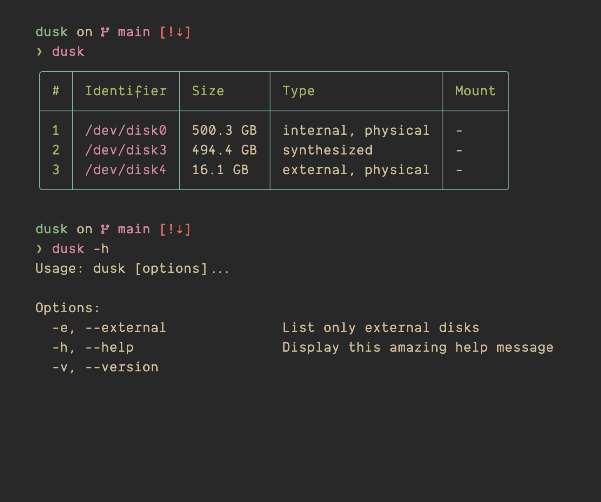

<div align="center">
<pre>
    ___                 __
  / _ \  __ __  ___   / /__
 / // / / // / (_-<  /  '_/
/____/  \_,_/ /___/ /_/\_\

</pre>
</div>



dusk is a simple macOS CLI tool written in **Bash 3.2+**. It wraps the `diskutil list` command to display all disks in a clean, colorful table. It also has an optional flag to show only external disks.

### Intall

To install this tool, you can use Homebrew:

```sh
brew tap matejstastny/dusk
brew install dusk
```

#### Manual Install

To install dusk from source, clone this repo and then run `sudo make install`. This will copy the script to `/usr/local/bin` so it can be used globally, and it also installs the dusk man page. To uninstall dusk, simply run `sudo make uninstall` in the cloned repo directory. This will remove both the script and the man page.

#### Flags

Running `dusk` lists all disks, numbers them for clarity, and for each one it displays the size, type, and mount point. If any of that information is not accessible, it will print a dash instead. Use `dusk -e` to show only external disks, `dusk -v` to check the version, and `dusk -h` to show a help message. The output is designed to be readable and suitable for both casual use or to be used inside another project. Dusk also uses the [`getoptions`](https://github.com/ko1nksm/getoptions) tool.
